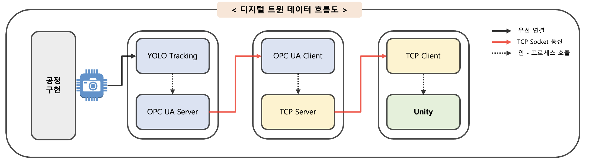

# EPP-DT-LEGO

## 프로젝트 개요

레고 기반 EPP 공정을 디지털 트윈으로 구현한 프로젝트  
YOLO + SORT 객체 추적과 OPC UA를 통한 데이터 전달, Unity를 이용한 시각화를 포함한다




- **lego-process**: 레고 기반 EPP 설비 구동, HSV 처리  
- **edge-node**: YOLO + SORT 객체 추적 및 OPC UA Server  
- **bridge-node**: OPC UA Client → TCP Server (데이터 중계)  
- **viewer-node**: TCP Client + Unity (C# 클라이언트, 디지털 트윈)  

전반적인 내용 및 아키텍처는 [docs/architecture.md](docs/architecture.md) 참고


## 실행 방법 (Quick Start)

### 1. 의존성 설치
```bash
pip install -r requirements.txt
```

## 2. 실행 순서

### 1) lego-process
레고 기반 설비 및 HSV 처리
```bash
cd src/lego-process
python 
```

### 2) edge-node

YOLO + SORT 추적 및 OPC UA 서버 실행

```bash
cd src/edge-node
python tracking_opcuaserver.py
```

### 3) bridge-node

OPC UA Client로 구독 후 TCP Server로 중계

```bash
cd src/bridge-node
python client_tcpserver.py
```

### 4) viewer-node

Unity에서 TCP Client 연결 → 디지털 트윈 시각화

```bash
# Unity Editor 실행 후
# Assets/Scripts/TcpClient.cs 포함된 Scene 실행
```

---

## 디렉터리 구조

```
EPP-DT/
├─ assets/                 # 이미지·도식 등 정적 파일
├─ docs/                   # 문서
│  ├─ architecture.md      # 전체 내용 
│  ├─ yolotracking.md      # YOLO 객체 추적
├─ src/                    # 소스 코드
│  ├─ lego-process/        # 레고 공정 코드
│  ├─ edge-node/           # YOLO+SORT + OPC UA Server
│  ├─ bridge-node/         # OPC UA Client → TCP Server
│  └─ viewer-node/         # Unity TCP Client 스크립트
```